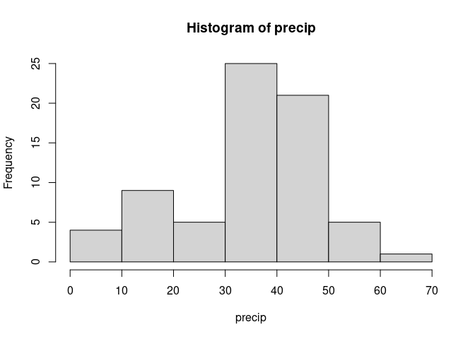
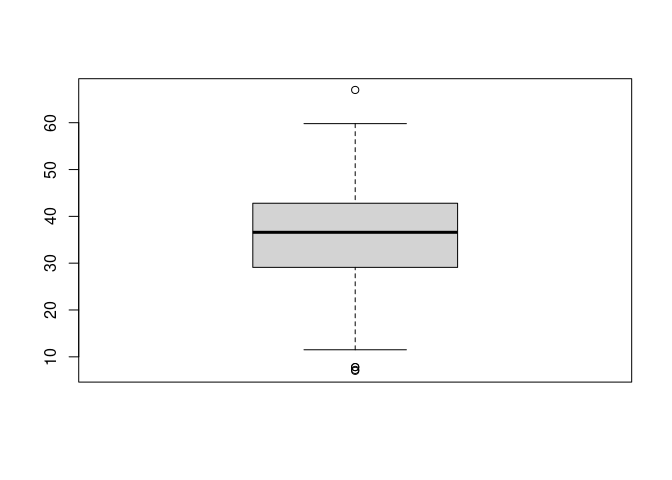

Exercises 01 tasks
================

# Wprowadzenie do programowania w R — cz. 1

Semestr zimowy 2021/22

## Zadania

Zadania oparte są na zbiorze danych `precip` z biblioteki standardowej R
(`?precip`). Znajdź następujące informacje.

``` r
help("precip")
precip
```

    ##              Mobile              Juneau             Phoenix         Little Rock 
    ##                67.0                54.7                 7.0                48.5 
    ##         Los Angeles          Sacramento       San Francisco              Denver 
    ##                14.0                17.2                20.7                13.0 
    ##            Hartford          Wilmington          Washington        Jacksonville 
    ##                43.4                40.2                38.9                54.5 
    ##               Miami             Atlanta            Honolulu               Boise 
    ##                59.8                48.3                22.9                11.5 
    ##             Chicago              Peoria        Indianapolis          Des Moines 
    ##                34.4                35.1                38.7                30.8 
    ##             Wichita          Louisville         New Orleans            Portland 
    ##                30.6                43.1                56.8                40.8 
    ##           Baltimore              Boston             Detroit    Sault Ste. Marie 
    ##                41.8                42.5                31.0                31.7 
    ##              Duluth Minneapolis/St Paul             Jackson         Kansas City 
    ##                30.2                25.9                49.2                37.0 
    ##            St Louis         Great Falls               Omaha                Reno 
    ##                35.9                15.0                30.2                 7.2 
    ##             Concord       Atlantic City         Albuquerque              Albany 
    ##                36.2                45.5                 7.8                33.4 
    ##             Buffalo            New York           Charlotte             Raleigh 
    ##                36.1                40.2                42.7                42.5 
    ##             Bismark          Cincinnati           Cleveland            Columbus 
    ##                16.2                39.0                35.0                37.0 
    ##       Oklahoma City            Portland        Philadelphia           Pittsburg 
    ##                31.4                37.6                39.9                36.2 
    ##          Providence            Columbia         Sioux Falls             Memphis 
    ##                42.8                46.4                24.7                49.1 
    ##           Nashville              Dallas             El Paso             Houston 
    ##                46.0                35.9                 7.8                48.2 
    ##      Salt Lake City          Burlington             Norfolk            Richmond 
    ##                15.2                32.5                44.7                42.6 
    ##      Seattle Tacoma             Spokane          Charleston           Milwaukee 
    ##                38.8                17.4                40.8                29.1 
    ##            Cheyenne            San Juan 
    ##                14.6                59.2

#### 1. Jaka jest średnia i mediana opadów w rejestrowanych miastach?

``` r
mean(precip)
```

    ## [1] 34.88571

``` r
median(precip)
```

    ## [1] 36.6

#### 2. Jaka jest wariancja i odchylenie standardowe opadów?

``` r
var(precip)
```

    ## [1] 187.8723

``` r
sd(precip)
```

    ## [1] 13.70665

#### 3. Jaki jest rozstęp opadów? \[**Uwaga**: standardowa funkcja `range()` nie liczy wprost rozstępu tylko wektor dwuelementowy zawierający minimum i maksimum\].

``` r
diff(range(precip))
```

    ## [1] 60

#### 4. Jaki jest rozstęp międzykwartylowy? Porównaj wynik uzyskany przy pomocy funkcji `IQR()` (`?IQR`) z wynikiem uzyskanym (jak na wykładzie) przy pomocy funkcji `fivenum()` (`?fivenum`).

``` r
IQR(precip)
```

    ## [1] 13.4

``` r
unname(diff(fivenum(precip)[c(2, 4)]))
```

    ## [1] 13.7

#### 5. Jakie jest odchylenie przeciętne od średniej? Jakie jest odchylenie przeciętne od mediany?

``` r
mean(abs(precip - mean(precip)))
```

    ## [1] 10.66857

``` r
mean(abs(precip - median(precip)))
```

    ## [1] 10.49143

#### 6. Jaki jest poziom opadów w miastach, których nazwa zaczyna się na “M” (`?startsWith`)?

``` r
precip[startsWith(names(precip), "M")]
```

    ##              Mobile               Miami Minneapolis/St Paul             Memphis 
    ##                67.0                59.8                25.9                49.1 
    ##           Milwaukee 
    ##                29.1

#### 7. W których miastach opady są równe średniej?

``` r
precip_mean <- mean(precip)
names(precip[precip == precip_mean])
```

    ## character(0)

#### 8. W których miastach opady różnią się od mediany nie więcej niż 0.5 cala?

**first solution**

``` r
precip_median <- median(precip)
for (i in seq_along(precip)){
  if (abs(precip[i] - precip_median) < 0.5){
    print(names(precip[i]))
  }
}
```

    ## [1] "Kansas City"
    ## [1] "Concord"
    ## [1] "Columbus"
    ## [1] "Pittsburg"

**second solution**

``` r
precip_median <- median(precip)
names(precip[abs(precip - precip_median) < 0.5])
```

    ## [1] "Kansas City" "Concord"     "Columbus"    "Pittsburg"

#### 9. W którym mieście opady są najmniejsze, a w którym największe?

``` r
names(which.min(precip))
```

    ## [1] "Phoenix"

``` r
names(which.max(precip))
```

    ## [1] "Mobile"

#### 10. Ile jest miast z opadami powyżej średniej?

``` r
sum(precip > mean(precip))
```

    ## [1] 42

#### 11. W których miastach opady leżą powyżej górnego kwartyla?

First solution

``` r
third_quartile <- fivenum(precip)[4]
for (i in seq_along(precip)){
  if (precip[i] > third_quartile){
    print(names(precip[i]))
  }
}
```

    ## [1] "Mobile"
    ## [1] "Juneau"
    ## [1] "Little Rock"
    ## [1] "Hartford"
    ## [1] "Jacksonville"
    ## [1] "Miami"
    ## [1] "Atlanta"
    ## [1] "Louisville"
    ## [1] "New Orleans"
    ## [1] "Jackson"
    ## [1] "Atlantic City"
    ## [1] "Columbia"
    ## [1] "Memphis"
    ## [1] "Nashville"
    ## [1] "Houston"
    ## [1] "Norfolk"
    ## [1] "San Juan"

Second solution

``` r
third_quartile <- fivenum(precip)[4]
names(precip[precip > third_quartile])
```

    ##  [1] "Mobile"        "Juneau"        "Little Rock"   "Hartford"     
    ##  [5] "Jacksonville"  "Miami"         "Atlanta"       "Louisville"   
    ##  [9] "New Orleans"   "Jackson"       "Atlantic City" "Columbia"     
    ## [13] "Memphis"       "Nashville"     "Houston"       "Norfolk"      
    ## [17] "San Juan"

#### 12. W których miastach opady leżą poniżej dolnego kwartyla?

First solution

``` r
first_quartile <- fivenum(precip)[2]
for (i in seq_along(precip)){
  if (precip[i] < first_quartile){
    print(names(precip[i]))
  }
}
```

    ## [1] "Phoenix"
    ## [1] "Los Angeles"
    ## [1] "Sacramento"
    ## [1] "San Francisco"
    ## [1] "Denver"
    ## [1] "Honolulu"
    ## [1] "Boise"
    ## [1] "Minneapolis/St Paul"
    ## [1] "Great Falls"
    ## [1] "Reno"
    ## [1] "Albuquerque"
    ## [1] "Bismark"
    ## [1] "Sioux Falls"
    ## [1] "El Paso"
    ## [1] "Salt Lake City"
    ## [1] "Spokane"
    ## [1] "Cheyenne"

Second solution

``` r
first_quartile <- fivenum(precip)[2]
names(precip[precip < first_quartile])
```

    ##  [1] "Phoenix"             "Los Angeles"         "Sacramento"         
    ##  [4] "San Francisco"       "Denver"              "Honolulu"           
    ##  [7] "Boise"               "Minneapolis/St Paul" "Great Falls"        
    ## [10] "Reno"                "Albuquerque"         "Bismark"            
    ## [13] "Sioux Falls"         "El Paso"             "Salt Lake City"     
    ## [16] "Spokane"             "Cheyenne"

#### 13. Narysuj histogram rozkładu. Jakie wnioski na temat rozkładu można z niego wyciągnąć?

``` r
hist(precip)
```

<!-- -->
#### 14. Narysuj wykres pudełkowy rozkładu. Jakie z niego płyną wnioski?
Które miasta stanowią wartości odstające na wykresie pudełkowym
(?boxplot, ?boxplot.stats)?

``` r
boxplot(precip)
```

<!-- -->
